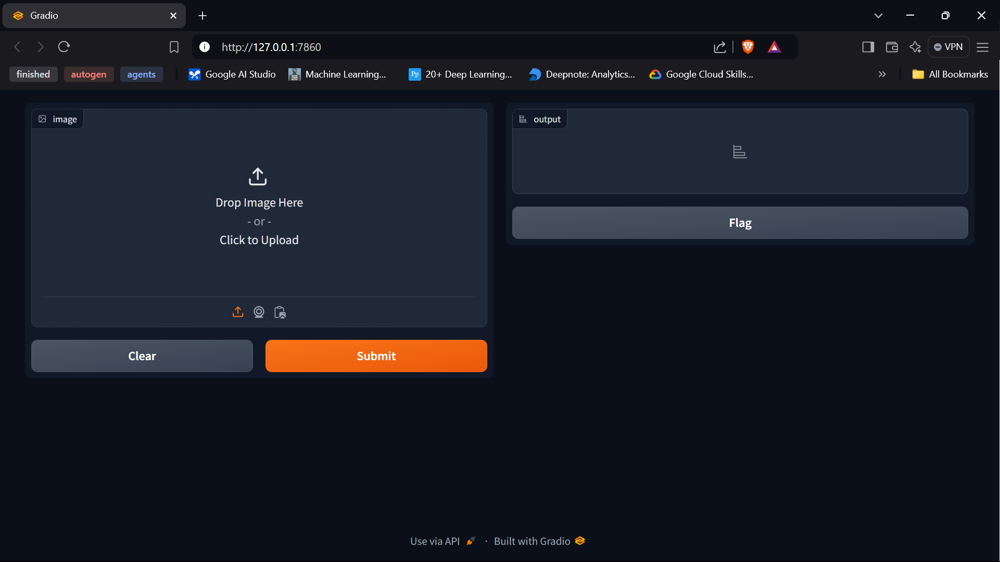

# CNN-from-Scratch

This project implements a Convolutional Neural Network (CNN) from scratch using NumPy. It's designed to recognize handwritten digits from the MNIST dataset.

## Project Overview

This CNN implementation includes:

- A convolutional layer
- A max pooling layer
- A fully connected layer
- Various activation functions (sigmoid, softmax)
- Cross-entropy loss function

The network is trained on the MNIST dataset and can be used to predict handwritten digits.

## Requirements

To run this project, you need the following dependencies:
`requirements.txt`


## Project Structure

- `main.py`: The main script to train the CNN
- `neural_network.py`: Contains the implementation of the CNN layers and the overall network structure
- `activation_functions.py`: Implements activation functions used in the network
- `loss_functions.py`: Contains the cross-entropy loss function and its derivative
- `data_loader.py`: Handles loading and preprocessing of the MNIST dataset
- `gradio_ui.py`: Provides a Gradio interface for testing the trained model

## How to Use

1. Install the required dependencies:
   ```
   pip install -r requirements.txt
   ```

2. Train the model:
   ```
   python main.py
   ```
   This will train the CNN on the MNIST dataset and save the trained weights.

3. To use the trained model with a Gradio interface:
   ```
   python gradio_ui.py
   ```
   This will launch a web interface where you can draw digits and get predictions from the model.
   

## Model Architecture

The CNN architecture consists of:
1. Convolutional Layer: 6 filters of size 5x5
2. Max Pooling Layer: 2x2 pool size with stride 2
3. Fully Connected Layer: Output size of 10 (for 10 digit classes)

## Training Process

The model is trained using:
- Mini-batch gradient descent
- Cross-entropy loss
- Customizable learning rate and number of epochs

## Performance

The model's performance metrics and accuracy will be displayed during and after training.

## License

This project is licensed under the MIT License. See the LICENSE file for details.

## Contributing

Contributions to improve the project are welcome. Please feel free to submit a Pull Request.

## Acknowledgments

- This project is an educational implementation to understand the inner workings of CNNs.
- The MNIST dataset is used for training and testing, provided through TensorFlow.
